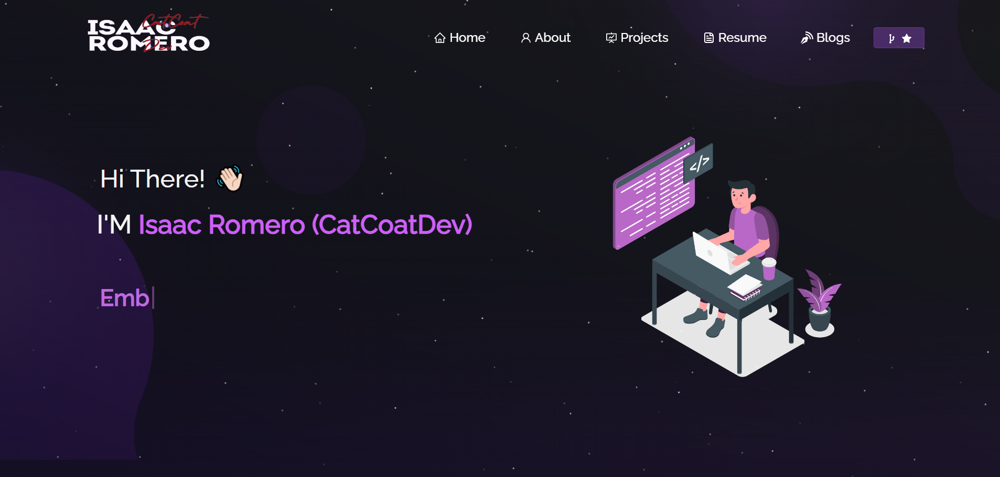

<h2 align="center">
  Portfolio Website - v2.0 
  <a href="" target="_blank">IsaacRomeroDev</a>
</h2>

  

 

## Clonar Original

Puedes bifurcar este repositorio para modificar y hacer cambios por tu cuenta. del creador original [clik here](https://github.com/soumyajit4419/Portfolio). ¡Gracias!

## Construido Con

Este proyecto fue construido utilizando estas tecnologías.

- React.js
- Node.js
- Express.js
- CSS3
- VsCode
- Vercel

## Características

**📖 Diseño de varias páginas**

**🎨 Estilizado con React-Bootstrap y Css con colores fáciles de personalizar**

**📱 Totalmente receptivo**

## Empezando

Clona este repositorio. Necesitarás tener `node.js` y `git` instalados globalmente en tu máquina.

## 🛠 Instrucciones de Instalación y Configuración

1. Instalación: `npm install`

2. En el directorio del proyecto, puedes ejecutar: `npm start`

Ejecuta la aplicación en modo de desarrollo.\
Abre [http://localhost:3000](http://localhost:3000) para verla en el navegador.
La página se recargará si realizas ediciones.

## Instrucciones de Uso

Abre la carpeta del proyecto y navega a `/src/components/`.  
Encontrarás todos los componentes utilizados y podrás editar tu información en consecuencia.

### Muestra tu apoyo

¡Dale una ⭐ si te gusta este sitio web!

#  Perfil Isaac Romero

## Herramientas

### Lenguajes de Programación
- Java
- Javascript
- Python
- C#
- MathLab
- Dart

### Base de Datos
- PostgreSQL
- MongoDB
- Firebase
- Oracle
- MySQL
- SQLite

### Cloud Computing
- Azure
- Render
- AWS
- Firebase

### Herramientas de Desarrollo Web
- NodeJS
- Django
- React
- Astro
- Tailwind CSS

### Herramientas de Desarrollo de Domótica
- Arduino IDE
- Inventor
- .NET
- Python

### Herramientas de Desarrollo IA
- PyTorch
- TensorFlow
- Scikit-learn
- Azure IA
- RoboFlow
- API ChatGPT, Cloude2
- Pinokio IA

## Habilidades
- Desarrollo de proyectos tecnológicos
- Planificaciones tecnológicas
- Gestor de proyectos tecnológicos
- Docencia en lógica de programación, programación orientada a objetos, estructura de datos, programación web, programación móvil
- Desarrollo de aplicaciones con sensores
- Desarrollo de aplicaciones con Inteligencia Artificial
- Desarrollo de aplicaciones médicas
- Desarrollo de aplicaciones para mipymes y pymes
- Gestor de bases de datos
- Manejo de versionamiento de Git
- Escalamiento de proyectos tecnológicos
- Manejo de big data
- Manejo de datos en diversas bases de datos
- Desarrollo de aplicaciones domóticas con inteligencia artificial
- Desarrollo de aplicaciones móviles
- Asesoramiento tecnológico

